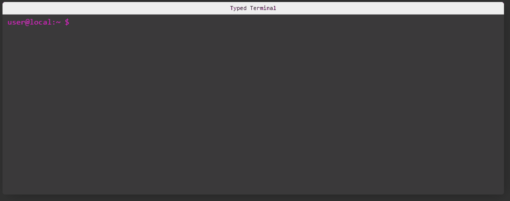

# react-component-typed-terminal
 
A react component for displaying a typing animation using [TypedJs](https://github.com/mattboldt/typed.js/) to display a terminal like component to display the strings.



You can interact with the component on the following storybook site [here](https://aaron-k-t-berry.github.io/react-component-typed-terminal/?path=/story/typedterminal--basic).

## Installation

```bash
yarn add react-component-typed-terminal
```

## Usage

You can import and use the component in your react app.

```jsx
import React from "react";
import { TypedTerminal } from "react-component-typed-terminal";

const typedJsProps = {
    loop: false,
    typeSpeed: 40,
    showCursor: false,
}

const terminalData = [
    {
      command: "ls -a ./folder-1",
      results: ["file 1", "file 2", "file 3", "file 4"],
    },
    {
      command: "ls -a ./folder-2",
      results: ["file 1", "file 2", "file 3", "file 4"],
    },
]

const App = () => {
    return <TypedTerminal typedJsProps={typedJsProps} terminalData={terminalData}>
}

```

The following parameters are available for the `TypedTerminal` component.

| Name         | Description                                                               | Default          |
| ------------ | ------------------------------------------------------------------------- | ---------------- |
| title        | Title to use for the displayed terminal component                         | `Typed Terminal` |
| promptText   | Terminal prompt text to show for each command                             | `user@local:~ $` |
| typedJsProps | Any TypedJs props that will be spread to its constructor when initialized | `{}`             |
| terminalData | Data used to construct the terminal output                                | `[]`             |

You can also see the parameters in use in the storybook site [here](https://aaron-k-t-berry.github.io/react-component-typed-terminal/?path=/story/typedterminal--basic).

The following parameters are available for the `TerminalLine` component.

| Name         | Description                                                               | Default          |
| ------------ | ------------------------------------------------------------------------- | ---------------- |
| hidden       | Wether to show the line or not                                            | `false`          |
| promptText   | Terminal prompt text to show for each command                             | `user@local:~ $` |
| typedJsProps | Any TypedJs props that will be spread to its constructor when initialized | `{}`             |

You can also see the parameters in use in the storybook site [here](https://aaron-k-t-berry.github.io/react-component-typed-terminal/?path=/story/terminalline--basic).

## Local development with storybook

This repo includes storybook to allow the component to be loaded locally and to view code changes as you make them to the local files.

```bash
yarn storybook
```

Once the server is running the storybook will be available at localhost:8080.
